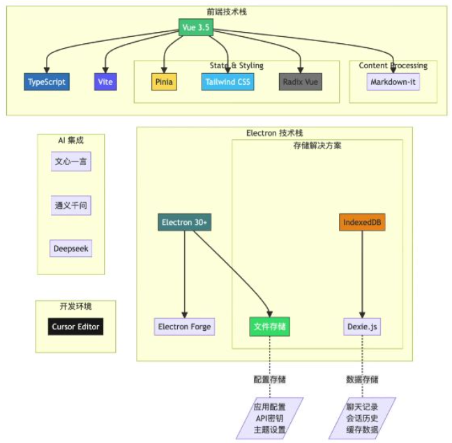
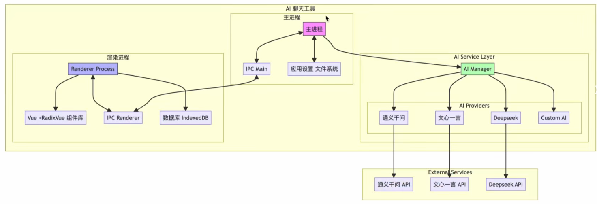

# 目标

* **课程目标**：通过实战项目打通文心一言/通义千问/Deepseek/Claude/Cursor与Vue3、Electron全链路技术点
* **技术组合**：结合当前前端和AI领域最热门的技术栈，包括Vue3.5、Electron和各种大模型API集成

# AI是否取代程序员

* **行业变革本质**：AI正在重塑工作方式，帮助开发者摆脱重复性基础工作，专注于更有价值的决策和创造性工作
* **效率提升案例**：使用Cursor编辑器半年多，编程效率显著提升，"仿佛雇了十个初级程序员"
* **不可替代性**：复杂业务需求中最难的部分是理解需求、设计架构和权衡技术方案，这些是AI目前难以替代的
* **职业警示**：只会基础知识、缺乏学习能力和全局思维的程序员可能被替代

---

* **核心观点**: AI带来的不是威胁，而是一次重大机遇，正在重塑我们的工作方式
* **本质改变**: AI帮助我们摆脱重复性基础工作，让我们能够专注于更有价值的决策和创造性工作

---

* **历史类比**: 如同当年互联网改变世界一样，AI正在创造新的机会
* **行业影响**: 从去年到今年，各行各业都在应用AI完成基础工作
* **典型案例**:
  * 文案工作者：AI快速生成初稿，人类进行创意优化
  * 财务人员：AI处理发票识别和数据录入，人类专注财务分析和决策支持
  * 销售和医疗：AI处理基础工作，提升整体效率和质量

---

* **根本原因**: 编程的本质不仅是写代码，更是解决问题的过程
* **AI的局限性**:
  * 难以理解复杂业务需求
  * 无法独立完成创新性解决方案
  * 系统设计能力有限
  * 问题诊断能力不足
  * 沟通协作能力缺失

---

# 学习什么进行破局

* **基础强化**：深入掌握JavaScript/TypeScript核心概念和高级特性
* **框架学习**：现代前端框架如Vue3和Electron桌面应用开发
* **AI能力**：大模型API调用和多模型集成方案
* **开发工具**：AI增强型开发环境如Cursor等高效使用
* **系统设计**：提升整体系统架构设计能力

---

程序元核心价值：

* **业务理解**: 将业务需求转化为技术方案的能力
* **系统架构**: 考虑高扩展性、安全性、性能等多维度设计
* **技术决策**: 在多种方案中进行权衡取舍
* **创新能力**: 探索新技术应用和解决方案

---

创新能力：

* **持续学习**: 避免成为"躺平工程师"，需要不断积累和提升技术水平
* **技术敏感度**: 保持对新技术的关注和学习能力

---

未来工程师应该掌握的技术栈：

* 基础知识：

  * **核心概念**: 深入理解编程语言的核心概念和高级特性
  * **前端框架**: 掌握至少一个现代前端框架（Vue/React/Angular）
  * **浏览器原理**: 理解浏览器工作原理和性能优化技巧
  * **网络基础**: 计算机网络基础知识
  * **跨平台开发**: Electron桌面应用开发能力（如AI聊天软件开发）
* AI工具的使用：

  * **Prompt工程**: 学会有效向AI提问的技巧
  * **API调用**: 掌握不同大模型API的调用方式
  * **多模型集成**: 整合通义千问/DeepSeek/文心一言/Google Gemini/ChatGPT/Claude等不同模型
* AI应用开发能力

  * **AI增强环境**: 熟练使用Cursor和Wind Serf等集成AI功能的编辑器
  * **智能功能**:

    * 智能代码补全和自动化重构
    * AI Agent自动生成代码
    * 文档自动化工具
    * 自动生成测试用例

---

软技能:

* **持续学习**: 技术发展迅速，需要不断学习新技术
* **系统设计**: 提升系统设计能力
* **协作能力**: 培养跨领域协作能力
* **角色演进**: 从界面开发者向全栈式"智能应用架构师"转变
* **核心竞争力**: 结合现代前端技术、Electron开发能力和AI技术应用能力

# 跨平台AI聊天软件

* **市场需求**：市面上已有ChatGPT、DeepSeek、豆包、Kim等独立聊天工具，需要统一集成方案
* **设计目标**：实现类似ChatBox的功能，同时提供可扩展架构便于未来接入更多大模型
  * 支持文心一言、通义千问、OpenAI、DeepSeek等多种大模型
  * 可处理文字问答和图片识别（如识别金毛寻回犬品种）
  * 代码高亮显示和编程问题解答能力
  * 主题切换、语言设置等个性化配置
  * 可添加/关闭多种模型，支持API密钥管理和连通性测试

# 技术栈

* **前端技术**：
  * Vue3.5 + TypeScript + Vite
  * Pinia 状态管理 + Tailwind CSS 样式
  * Radix Vue 组件库 + Markdown-it 内容处理
* **Electron 集成**：
  * Electron 30 + Electron Forge
  * IndexedDB + Dexie.js 数据存储方案
* **AI开发环境**：trae 深度集成

# 架构图

* **主进程**：通过IPC Main处理文件系统、应用设置等底层功能
* **渲染进程**：基于Vue+Radix Vue构建UI，通过IPC Renderer与主进程通信
* **AI服务层**：
  * AI Manager统一管理多个AI Provider（文心一言、通义千问、DeepSeek等）
  * 支持扩展自定义AI和外部API服务集成
* **数据存储**：使用IndexedDB管理聊天记录、API密钥、主题设置等数据

# 学习安排

* **基础模块**：
  * **内容构成**：包含TypeScript核心概念与实践、Vue3.5新特性与最佳实践、Electron跨平台开发基础三大板块
  * **学习建议**：建议基础薄弱者系统学习，已掌握者可跳过，强调"基础决定上限"的学习理念
  * **特殊说明**：该部分为赠送内容，不计入正式课程时长
* **项目实践方案**：
  * **阶段划分**：采用渐进式开发策略，前期纯手写代码，后期引入Cursor AI辅助
  * **设计原理**：基于"先理解后使用"原则，类比驾驶学习需先掌握原理再使用辅助功能
  * **手写阶段价值**：帮助建立项目架构认知，明确模块关系，培养代码直觉
  * **AI介入时机**：在需要处理复杂逻辑或大量文档查阅时启用，符合AI最佳实践场景

# 学习前提

**技术储备**：

* **前端三要素**：需掌握HTML/CSS/JavaScript基础开发能力
* **运行时环境**：要求具备Node.js和npm/npx的实战使用经验
* **最低要求**：仅需满足上述两点即可开始课程学习

# **课程收获**

**技术栈掌握**：系统习得Vue3+Electron最新技术体系，包括核心概念和深度应用

**AI能力培养**：

* 四大经典AI大模型的工业级实战应用
* 多模型协同解决方案设计能力
* Cursor辅助编程实现开发效率倍增

**职业发展**：培养架构师级别的系统设计能力，塑造面向未来的技术竞争力。
