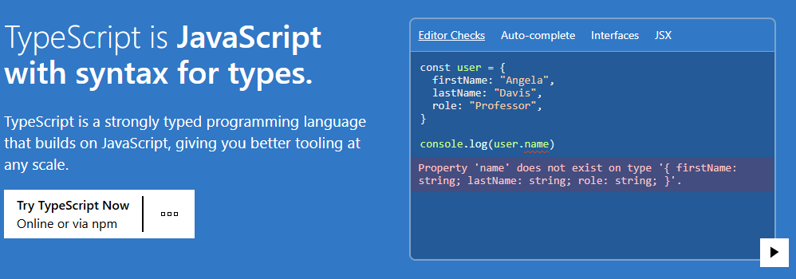

# 1. 了解 Typescript

* **框架应用**: Vue3、Angular、Element-plus 等知名框架都使用 Typescript 编写
* **语言分类**:
  * 动态类型语言：运行时才做数据检查，如JavaScript/Ruby/Python
  * 静态类型语言：编译阶段进行数据类型检查，如C/C++/C#/Java

## 1.1. 什么是 TS

* **定义**: JavaScript的超集，添加了类型系统和ES6+语法支持
* **特点**:
  * 静态类型语言风格
  * 支持ES6到ES11语法
  * 跨平台运行能力
  * 完全开源
* **官网口号**: "JavaScript with syntax for types"； [https://www.typescriptlang.org/zh/](https://www.typescriptlang.org/zh/)



## 1.2. 为什么要学习它

**1）程序更容易理解**

**代码自解释**: 通过类型定义就能知道函数参数、返回值类型，无需查阅文档

**示例**: jQuery的ajax方法通过类型提示就能了解所有参数和用法

---

**2）效率更高**

**开发辅助**:

* 代码自动补全
* 接口提示
* 定义快速跳转

**实际效果**: 减少查阅文档时间，提升编码速度

---

**3）更少的错误**

* **编译期检查**: 提前发现类型错误，避免运行时错误
* **常见错误**: "Cannot read property 'xxx' of undefined" 排名 JavaScript 错误第一位
* **错误预防**: 方法不存在时会立即提示，避免错误调用

---

**4）非常好的包容性**

* **兼容性**:
  * 可直接将.js文件重命名为.ts
  * 可为第三方库编写类型声明文件
  * 主流项目都提供类型支持
* **无缝衔接**: 与现有JavaScript生态完美融合

---

5）小问题

* **学习成本**: 需要掌握interface、generic等新概念
* **开发成本**: 短期需要编写类型定义，但长期节省时间
* **适用场景**: 简单页面不需要使用，适合大型项目维护

---

# 2. 环境安装

* **版本要求**: 建议Node版本升级到16以上，课程中使用的是16.13.0版本
* **版本管理工具**: 推荐使用nvm(Node Version Manager)管理多个Node版本，方便切换不同项目所需版本
* **官网指引**: nvm的安装步骤可参考其官网(nvm-sh/nvm)的说明文档

安装 ts

```node
nvm -v
# 1.2.2

node -v
# v24.7.0

npm install -g typescript

tsc --version
# Version 5.9.2
```

注意：

* **项目级安装**: 适合需要维护多个项目不同TypeScript版本的场景，保持项目独立性
* **全局安装**: 适合快速测试想法，使用命令npm install -g typescript安装最新版
* **版本指定**: 如需与课程完全一致，可指定版本号安装；使用最新版遇到API变化需自行查阅变更日志
* **安装命令**: npm install -g typescript，其中-g表示global(全局)安装
* **验证安装**: 使用tsc --version查看安装版本(当前最新为5.1.6)
* **编译器说明**: tsc全称为TypeScript Compiler，是TypeScript的编译器工具

# 3. 第一个ts程序

1. 在编辑器中创建测试文件夹（示例命名为"test"）
2. 在文件夹内添加新文件
3. **文件规范**：**扩展名**：需使用.ts作为文件后缀；**内容特点**：初始文件内容与普通JavaScript(.js)文件完全一致
4. **编译命令**：使用tsc命令加上对应的.ts文件名进行编译，例如  =》 **tsc test.ts**
5. 编译结果分析：TypeScript编译为JavaScript后，生成的代码与原文件基本一致，说明TypeScript天生适配JavaScript。
6. 重复编译与文件处理：重新编译时会自动覆盖之前生成的.js文件，但为保险起见可以手动删除旧文件。
7. **编译结果验证**：即使添加了类型注解，编译后的JavaScript代码也不会包含类型检查逻辑。
8. **静态检查特性**：TypeScript只进行静态类型检查，编译时发现错误会报错，但不会在生成的JavaScript代码中插入检查逻辑。
9. **开发阶段验证**：所有类型检查都在编译阶段完成，运行时JavaScript代码不包含额外类型验证。
